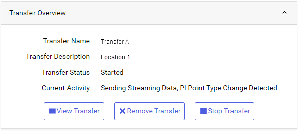

# What is a PI point type change?

A PI point type change occurs when the a PI point's type is changed on the source PI Data Archive after the corresponding stream has been created in the OCS Sequential Data Store (SDS) database. When PI to OCS Services detects this change, it is unable to determine why the change occurred and takes the following actions:

- Displays the `PI Point Type Change Detected` message next to the **Current Activity** field in the Details pane as shown below 
- Prevents any data being sent from the source PI point to the SDS stream until the type is changed to match the corresponding PI point type in SDS 
- Logs details about the corresponding SDS stream in the both the Windows Event Viewer and OCS logs 

**Zane & Janelle: Do we need the next sentence & bullets?**

A point change can occur for the following reasons:

* The source tag had an incorrect configuration of data and type. The data and tag must be deleted and recreated.
* The source tag was misconfigured initially. For example, the tag updated from a `Float32` to a `Float64`. The data is still relevant and should be kept.
* Other reasons.
<!--Angela Flores 6/28/21 This list is oddly specific. Also, what is PI to OCS Services? And PI to OCS service? This topic still needs work. -->

Once an SDS stream has been created, its underlying SdsType cannot change. As a result, new data from the PI point in question cannot be stored in the same stream. You must decide what to do with the existing SDS stream and data that has already been transferred by taking the following corrective actions:

- View the [Windows Event Viewer logs](xref:) and [OCS logs](xref:) to determine if the PI point type was changed before or after the transfer was started.

    **Note:** The Windows Event Viewer logs is the preferred source of information for PI point type changs.

- Take one of the following actions to either restart or recreate the transfer in order to resend data from the source PI point:

    - To maintain the data and continue streaming data for that particular tag, create a new SDS stream and copy the data to that new stream. Then, delete the SDS stream in question and restart the transfer.
    - To maintain the data, but not the streaming data for that particular tag, create a new transfer without the PI point in question and then start the transfer. 
    - To stream data for that particular tag, but not maintain previously transferred data, delete the SDS stream in question and restart the transfer.

To see what types of point coercions are supported in PI Data Archive, refer to the ["Allowable point type coercions"](https://docs.osisoft.com/bundle/pi-server/page/allowable-point-type-coercions.html) topic.<!--Angela Flores 6/28/21 should that be "coercions" or "conversions"? -->
