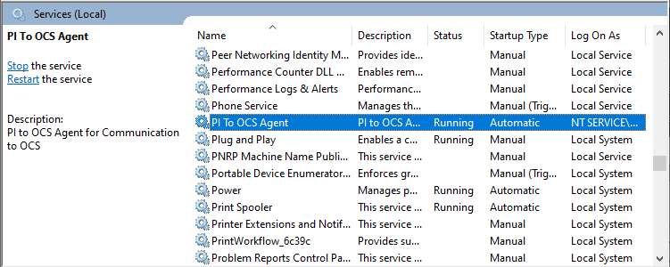
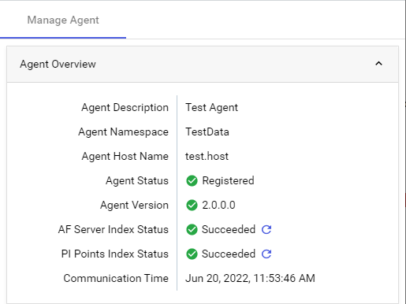

# Install the PI to OCS Agent

This topic explains how to install the PI to OCS agent and then verify that the installed agent is running and registered on OCS. 

**Important:** When you install the PI to OCS Agent, follow these guidelines:

    * Install the agent on a host computer that is separate from your PI Data Archive deployment.
    * Use a domain account that has been granted Administrator privileges on a computer registered to the same domain.
    * Enable read access to Data Archive security tables and the PI points and data to be transferred.

    The PI to OCS Agent requires the Windows service account to "run as user". Read access to the following PI Data Archive data is required:

    * Archive data (the PIARCDATA Security table)
    * The PI points configuration table (PIPOINT Security table)
    * The PI points and data to be transferred

## Install the PI to OCS Agent

This procedure explains how to download and install the PI to OCS Agent.  

1. In the OCS portal, select the  icon, then click **Data Collection > PI to OCS Agents**.

   **Result:** The `PI to OCS Agents` window opens.

1. Select **Download Agent**.

    The `Agent Installer Download` dialog box opens. 

1. Download the agent to the desired location.
 
   **Tip:** You can download the PI to OCS Agent installation kit and then transfer it to the host computer. 

1. Navigate to the downloaded PI to OCS agent installation file.

    **Note:** The PI to OCS Agent installation cannot be completed if the system time is not correct. Additionally, you cannot complete the PI to OCS Agent installation if Internet Explorer Enhanced Security configuration is enabled. See [Disable Internet Explorer Enhanced Security Configuration](xref:disable-ie-security) for details.

1. Right-click the PI to OCS Agent installation file, then click **Run as administrator**.

1. Select **Yes** in the **Welcome** screen, then select **Next**.

   **Result:** The **Company Information** screen opens.
      
1. Enter your OCS tenant ID or company alias in the **Tenant ID or Company Alias** text box, then select **Next**.

    **Note:** You are prompted to log on with your tenant account in OCS.  The account used to log on must be assigned to the OCS Tenant Administrator role to complete the PI to OCS Agent installation. Close the browser window after successful user authentication in OCS.

1. Select **Next** in the PI to OCS Agent **Browser Login** screen.

    **Result:** The **Namespace** screen opens. 

1. Select or enter the following information for your PI to OCS connection, then select **Next**:

    *  **Namespace**: Select the location where your transferred data will be stored. The region indicates where the namespace resides. Streaming data sent by the PI to OCS Agent only goes to the selected namespace's region.
    * **Agent Description:** Enter an optional name for your agent.

    

1. Select the service account type for the connection, then select **Install**:

    * **NT Service**: Use an NT account to connect to a Data Archive.
    * **This account**: Specify a user name and password (domain\account) to connect to a Data Archive.

    **Important:** The account used to run the PI to OCS Service requires Administrator privileges. Read permission to the PIARCDATA Security and PIPOINT Security tables, and the PI points and data to be transferred are also required.

    **Result:** The PI to OCS Agent is installed.
    **Note:** Installation can take a few moments.

1. Select **Close** to exit out of the PI to OCS Agent wizard.
    
    **Result**: The PI to OCS Configuration Utility opens. See [Run the PI to OCS Agent Configuration Utility](xref:pi-to-ocs-utility) for instructions.

    **Note:** The PI to OCS Agent is not registered until you add and configure a Data Archive.

## Verify the PI to OCS Agent is running and registered

After agent installation, follow these steps to confirm the PI to OCS Agent service is running and registered in OCS.

1. On the agent host machine, type *services.msc* in the text box next to the Windows menu button, then select ENTER.

2. In the `Services` window, scroll to and verify that that the PI to OCS Agent’s status is running.

3. Go to the `PI to OCS Agents` window in OCS, then select the connection you just created.

4. On the **Details** pane, verify that "Registered" appears next to the **Agent Status** field.

   **Note:**  The agent status is also displayed in the PI to OCS Configuration Utility.  See [List of agent status states](xref:pi-to-ocs-utility#list-of-agent-status-states) for a list of states and descriptions that explain why an agent may not be running.