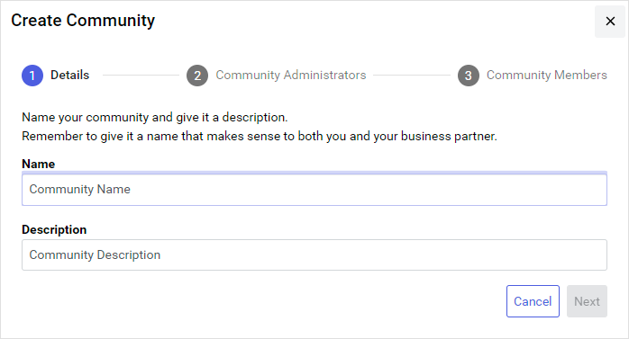
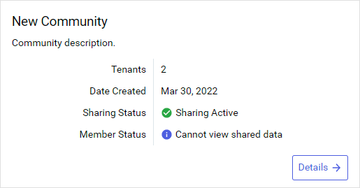

# Part 1: Create a community

[!include[create-community-intro](includes/create-community-intro.md)]

## Prerequisites

[!include[prereq-administrative-tenant](includes/prereq-administrative-tenant.md)]

## To create a community

To create a community, follow these steps:

1. In the left pane, select **Data Management** > **Communities**.

1. Select **Add Community**.

    The **Create Community** wizard opens to the `Details` page.
    

1. On the `Details` page, enter a **Name** and **Description**. Then select **Next**.

1. On the `Community Administrators` page, choose the [roles](xref:ccRoles) that are assigned [community administration permissions](xref:community-community-roles#community-administrators). Users assigned these roles can perform administration tasks for both their own tenant and the entire community. You can either accept the default roles or add new ones.

    

        
<strong>To add roles</strong>

        
    

    

        
<strong>To remove roles</strong>

        
    

    **Tip:** You can edit the default roles that are listed. For more information, see <xref:communities-manage-default-admins>.

1. After you finish, select **Next**.

1. On the `Community Members` page, add [Community Members](xref:community-community-roles#community-member), which are users within your tenant that have read access to the community and its data.
    
    **Note:** Community Administrators are not automatically added as Community Members. If you want your Community Administrators to also be Community Members with access to shared resources, you must manually add them.
    
    

        
<strong>To add members</strong>

        
    

1. After you finish, select **Create**.

    The community is created and added to the `Communities` page.
    
    

## Next steps

Invite tenants to your community. Continue to <xref:community-invite>.
