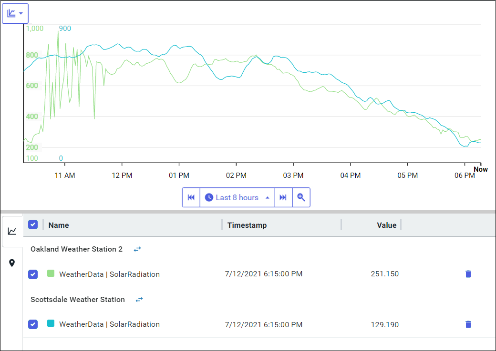
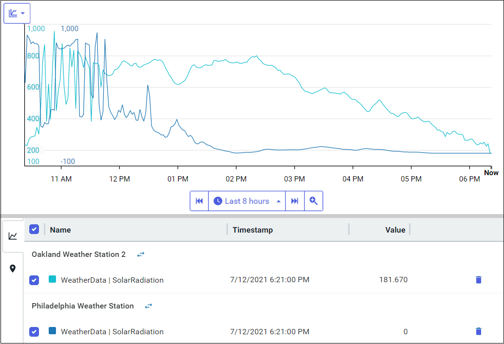

# Context switch in visual trending 

The topics below describe how to use context switching on the Trend page:

- [Asset switch in visual trending](#asset-switch-visual-trend)
- [Asset switch in performance testing](#asset-switch-perf-test)

## Asset switch in visual trending

On the Trend page, you can switch between assets that are created with the same asset type. Instead of searching for and adding the traces for each asset, the Swap Asset feature streamlines this process. You add the traces for a single asset. Then you use the Swap Asset feature to replace the asset in the trend with another asset.  

## Procedure

1. On the Trend page, click the **Assets** tab in the `Add Traces` pane. 

2. Add one or more traces for the same asset to the trend.

   **Note:** The asset must be created from an asset type.

   The screen capture shows several traces for the Philadelphia Weather Station asset. The data displayed show the wind speed, wind direction, and the relative barometric pressure.

   

3. Click the  icon next to the asset name in the legend table to open the `Swap Asset` window. 

   The `Swap Asset` window displays a list of assets of the same asset type. In the screen capture below, the listed assets are of the same asset type as the Philadelphia Weather Station asset. All assets are created with the Weather Station asset type.

   

4. Select the asset you want to view and click **Continue**.

   The Trend page replaces the traces of the original asset with the new asset. The screen capture shows that the Philadelphia Weather station is replaced with the Oakland Weather Station 2 asset. The three traces that were previously displayed for the Philadelphia Weather station are now displayed for the Oakland Weather Station 2 asset. 

   

## Asset switch in performance testing

Easily switching between assets is useful in performance testing and benchmarking. For example, assume Asset A provides the standard against which other assets are compared. You add Asset A and Asset B to the trend, comparing B against A. Then you use the Asset Swap feature to replace Asset B with Asset C, and C is compared to A.

## Procedure

1. On the Trend page, click the **Assets** tab in the `Add Traces` pane. 

2. Add a trace for the asset that provides the standard for all assets.

3. Add a second trace for an asset you want to compare against this standard.

   In the screen capture below, there are two traces with solar radiation data. In this example, the Oakland Weather Station is the standard and the Scottsdale Weather Station trace is compared against it.

   

4. Click the icon for the asset you are comparing with the standard.

   In this example, you would click the icon for the Scottsdale Weather Station.

5. In the `Swap Asset` window, select another asset and click **Continue**. 

   In this example, the solar radiation trace for the Scottsdale Weather Station is replaced with the solar radiation trace for the Philadelphia Weather Station.  The trace for the Philadelphia Weather Station can now be compared against the Oakland Weather Station.

   
