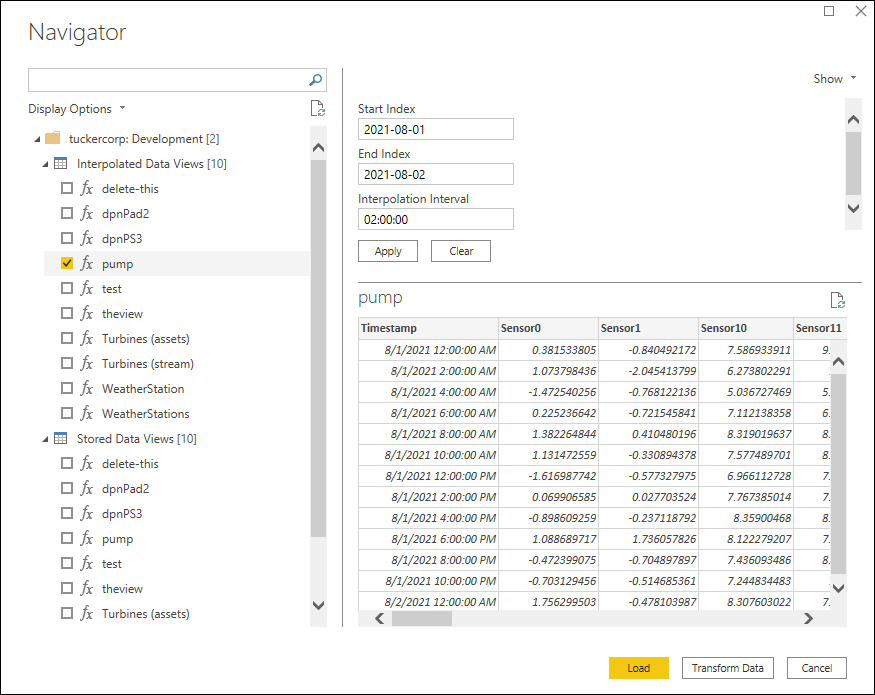
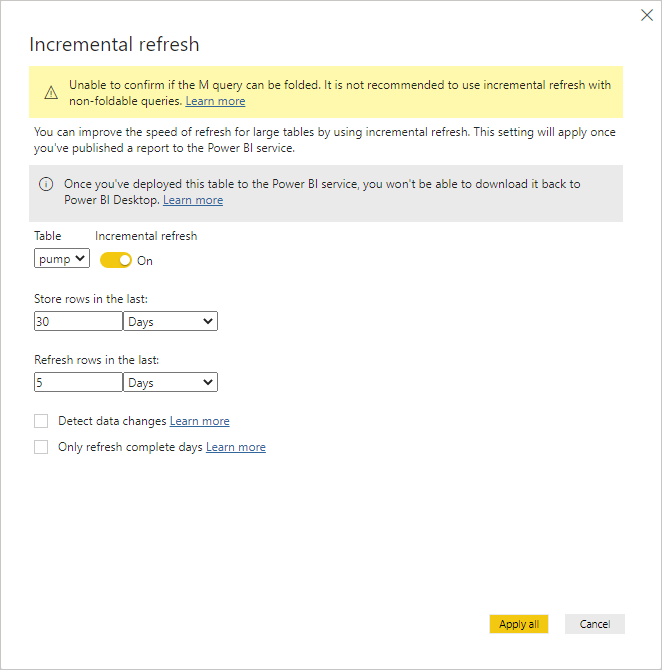

# OSIsoft Cloud Services Power BI Connector

The OSIsoft Cloud Services Power BI Connector retrieves data views from OCS and makes them available in Microsoft Power BI for advanced data visualization and analysis. Install the connector to retrieve data for use with Microsoft Power BI as described in this section.

## Install OSIsoft Cloud Services Power BI Connector
<!-- Start WI 242327-->
**Note:** Microsoft Edge WebView 2 Runtime is required for OSIsoft Cloud Services Power BI Connector installation.
<!-- End WI 242327-->
<!-- Start WI 217906 and 237964-->
1. Download the OCSPowerBIConnector.exe file from the [OSIsoft Customer portal](https://customers.osisoft.com/s/products).

1. Install OSIsoft Cloud Services Power BI Connector by either the setup wizard or silent installation.

    1. Setup wizard
        1. Double click the `OCSPowerBIConnector.exe` file and select **Next**.
        1. Optional: To install the connector to an on-premises data gateway, select `On-premises data gateway installation` and enter the directory where you want to install the connector. 

           **Note:** OSIsoft Cloud Services Power BI Connector supports silent installation for on-premises data gateway installations.

    1. Silent installation
        1. Open a command prompt window and type following command. 
        `.\OCSDataConnectorInstaller.exe -Y INSTALLDIR="<install path>" /quiet`

           **Note:** OSIsoft Cloud Services Power BI Connector supports silent installation for on-premises data gateway installations.
<!-- End WI 217906 and 237964-->
## Retrieve data with OSIsoft Cloud Services Power BI Connector

1. In Microsoft Power BI Desktop, in the entry field of the **Get Data** window, type *OSI*. The **OSIsoft Cloud Services Data Views** connector file displays in the **All** pane.

   

1. Click the **OSIsoft Cloud Services Data Views** connector file, and then click **Connect**.

1. Click **Continue** in the **Connecting to a third-party service** warning.

1. In the **OSIsoft Cloud Services Data Views** window, enter the OCS tenant and namespace for the data views you want to access, and then click **OK**. The OSIsoft Cloud Services sign-in window displays if you have not already signed into OCS.

    - If you have not already signed into OCS, click **Sign in as different user** and complete the OCS user authentication process.

1. In the **OSIsoft Cloud Services Data Views** sign-in window, click **Connect**. The **Navigator** pane displays.
<!-- Start WI 246187-->
1. In the **Navigator** pane, click on either Interpolated Data Views or Stored Data Views, and select the data view you want to work with in Microsoft Power BI.

   

1. For Stored Data Views, specify a Start and End Index for the selected data view, and click **Apply** to apply the values you have specified. For Interpolated data views, specify also a Interpolation Interval. Repeat for each additional data view as needed.

    **Note**: If a data view has default values, enter new values and click **Apply** to accept the defaults.

   
<!-- End WI 246187-->
1. Click **Load** at the bottom of the **Navigator** pane to load all selected data views to Microsoft Power BI.
<!-- Start WI 245245 and 237745-->
## Edit the data view query in Microsoft Power BI

In Microsoft Power BI, you can view and edit the query generated from the connector to modify the Start and End index to different dates or relative start and end dates. You can also use Microsoft Power BI to enable a rolling incremental refresh of data.

1. In Microsoft Power BI, click **Transform data** to view the query with Power Query Editor. 
    - Click **View**, and then select **Formula Bar** to view the query function from the connector.  
     

         Or,
    - Click **Home**, and then select **Advanced Editor** to view additional query configuration details such as the name of the connector, name of the OCS tenant and namespace, the data view type (Interpolated or Stored), the name of the data view, and the function.
         
     

1. Modify the Start and End index to different dates or relative start and end dates in the function with Power Query M Formula Language code. For information about Power Query M Formula Language code, see [Power Query M formula language](https://docs.microsoft.com/en-us/powerquery-m/). 

    - Example base query (query shown in the screenshots in the previous step).  
    Start Index: August 1, 2021 Midnight 
    End Index: August 2, 2021 Midnight 
    Interval: 2 hours 
     `#datetimezone(2021, 8, 1, 0, 0, 0, -7, 0), #datetimezone(2021, 8, 2, 0, 0, 0, -7, 0), #duration(0, 2, 0, 0)` 
    - Modify the start and end index date to different dates, and change the interval.   
    Start Index: July 15, 2021 Midnight 
    End Index: August 15, 2021 1:00 AM 
    Interval: 1 hour 
    `#datetimezone(2021, 7, 15, 0, 0, 0, -7, 0), #datetimezone(2021, 8, 15, 0, 0, 0, -7, 0), #duration(0, 1, 0, 0)`. 
    - Modify the start and end index date to use a relative start and end index.  
    Start Index: 2 months ago 
    Start Index: Now 
    `Date.AddMonths(DateTimeZone.LocalNow(), -2), DateTimeZone.LocalNow()`

    - Additional examples of common relative time configurations.

        | Query description                                                      | Code                          |
        |-------------------------------------------------------------------------------------------------|-------------------------------|
        | Rolling 1 day period Start Index: 1 day ago End Index: Now | `Date.AddDays(DateTimeZone.LocalNow(), -1), DateTimeZone.LocalNow()` |
        | Start of last month through now Start Index: First day of last month at midnight End Index: Now | `Date.StartOfMonth(Date.AddMonths(DateTimeZone.LocalNow(), -1)), DateTimeZone.LocalNow()` |
        | Incremental refresh Rolling 3 year period                                                       | `Date.AddYears(DateTimeZone.LocalNow(), -3), DateTimeZone.LocalNow()` |

         See the [Power Query M function reference](https://docs.microsoft.com/en-us/powerquery-m/power-query-m-function-reference) page on functions you can use in your query.

1. Click **Close & Apply**, and then select `Close & Apply` in Power Query Editor to save your query.
1. Optional. Use Microsoft Power BI Desktop to enable incremental refresh of data.
     1. In Microsoft Power BI, click **Transform data** to open Power Query Editor.
     1. Click **Manage Parameters**, and then select `Manage Parameters` in the menu.
     1. Add the following parameters in the `Manage Parameters` window, and then click **OK**.  
        | Parameter              | Code                          |
         |---------------------|-------------------------------|
        | `RangeStart` | Description: `<optional>`  Required: `selected`  Type: `Date/Time`  Suggested Values: `<Any value>, <List of values>, <Query>`  Current Value: `<Start date of the date range>` |
        | `RangeEnd` | Description: `<optional>`  Required: `selected`  Type: `Date/Time`  Suggested Values: `<Any value>, <List of values>, <Query>`  Current Value: `<End date of the date range>` |
     **Note:** `RangeStart` and `RangeEnd` must be named and mixed-cased as is for incremental refresh to work.

     1. Edit the function in query to use the `RangeStart` and `RangeEnd` parameters defined in the previous step. For example, 
     `DateTimeZone.From(RangeStart), DateTimeZone.From(RangeEnd), #duration(0, 1, 0, 0)`.
     1. Click **Close & Apply**, and then select `Close & Apply` in Power Query Editor.
     1. Click **Home**, and in the `Fields` pane right-click your data view type, and then choose `Incremental Refresh` in the drop-down menu.
     1. Turn on `Incremental Refresh` and edit the values in the `Store rows in the last` fields. This builds a cache of data in Microsoft Power BI so you will not need to re-query the original data view.  
     The example below shows that incremental refresh is turned on, will cache 30 days of data, and the last 5 days will be a rolling refresh of data.  
     
<!-- End WI 245245  and 237745-->
## Create a visualization of the data view in Microsoft Power BI
1. Select or drag fields from the **Fields** pane onto the report canvas.
1. Click the **Visualizations** pane and select a visualization option you want to create.
